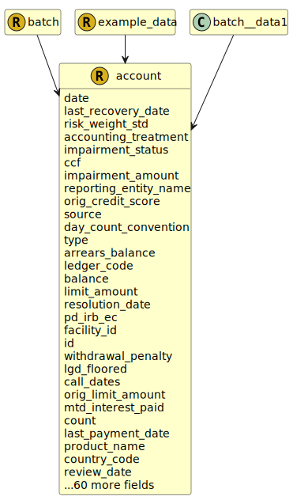

&lt;&nbsp; [Namespace](index.md)
#  fire.model.account
>  
>An Account represents a financial account that describes the funds that a customer has entrusted to a financial institution in the form of deposits or credit balances.
> 

## Local Fields

<table >
  <thead>
    <tr>
      <th>Name</th>
      <th>Datatype</th>
      <th>Description</th>
    </tr>
  </thead>
  <tbody>
    <tr>
        <td>date</td>
        <td>datetime</td>
        <td>
The observation or value date for the data in this object. Formatted as YYYY-MM-DDTHH:MM:SSZ in accordance with ISO 8601.

</td>
    </tr>
    <tr>
        <td>risk_weight_std</td>
        <td><i>double</i> <b>?</b></td>
        <td>
The standardised approach risk weight represented as a decimal/float such that 1.5% is 0.015.

</td>
    </tr>
    <tr>
        <td>accounting_treatment</td>
        <td><i><a href='UDT-fire.model.accounting_treatment.html'>&nbsp;fire.model.accounting_treatment</a></i> <b>?</b></td>
        <td></td>
    </tr>
    <tr>
        <td>impairment_status</td>
        <td><i><a href='UDT-fire.model.impairment_status.html'>&nbsp;fire.model.impairment_status</a></i> <b>?</b></td>
        <td></td>
    </tr>
    <tr>
        <td>ccf</td>
        <td><i>double(0.0, *)</i> <b>?</b></td>
        <td></td>
    </tr>
    <tr>
        <td>impairment_amount</td>
        <td><i>int(0, *)</i> <b>?</b></td>
        <td>
The impairment amount is the allowance set aside by the firm that accounts for the event that the asset becomes impaired in the future.

</td>
    </tr>
    <tr>
        <td>reporting_entity_name</td>
        <td><i>string</i> <b>?</b></td>
        <td>
The name of the reporting legal entity for display purposes.

</td>
    </tr>
    <tr>
        <td>orig_credit_score</td>
        <td><i>int</i> <b>?</b></td>
        <td>
The credit score of the customer at origination of the product using a commercially available credit bureau score.

</td>
    </tr>
    <tr>
        <td>source</td>
        <td><i>string</i> <b>?</b></td>
        <td>
The source(s) where this data originated. If more than one source needs to be stored for data lineage, it should be separated by a dash. eg. Source1-Source2

</td>
    </tr>
    <tr>
        <td>day_count_convention</td>
        <td><i><a href='UDT-fire.model.day_count_convention.html'>&nbsp;fire.model.day_count_convention</a></i> <b>?</b></td>
        <td>
The standardised methodology for calculating the number of days between two dates. It is used to calculate the amount of accrued interest or the present value.

</td>
    </tr>
    <tr>
        <td>type</td>
        <td><i><a href='UDT-fire.model.account_type.html'>&nbsp;fire.model.account_type</a></i> <b>?</b></td>
        <td>
This is the type of the account with regards to common regulatory classifications.

</td>
    </tr>
    <tr>
        <td>arrears_balance</td>
        <td><i>int</i> <b>?</b></td>
        <td>
The balance of the capital amount that is considered to be in arrears (for overdrafts/credit cards). Monetary type represented as a naturally positive integer number of cents/pence.

</td>
    </tr>
    <tr>
        <td>ledger_code</td>
        <td><i>string</i> <b>?</b></td>
        <td>
The internal ledger code or line item name.

</td>
    </tr>
    <tr>
        <td>balance</td>
        <td><i>int</i> <b>?</b></td>
        <td>
The contractual balance on the date and in the currency given. Monetary type represented as a naturally positive integer number of cents/pence.

</td>
    </tr>
    <tr>
        <td>limit_amount</td>
        <td><i>int</i> <b>?</b></td>
        <td>
The minimum balance the customer can go overdrawn in their account.

</td>
    </tr>
    <tr>
        <td>id</td>
        <td>string</td>
        <td>
The unique identifier for the record within the firm.

</td>
    </tr>
    <tr>
        <td>withdrawal_penalty</td>
        <td><i>int</i> <b>?</b></td>
        <td>
This is the penalty incurred by the customer for an early withdrawal on this account. An early withdrawal is defined as a withdrawal prior to the next_withdrawal_date. Monetary type represented as a naturally positive integer number of cents/pence.

</td>
    </tr>
    <tr>
        <td>lgd_floored</td>
        <td><i>double(0.0, 1.0)</i> <b>?</b></td>
        <td>
The final LGD value after the relevant floors have been applied. To be used in the IRB RWA calculations.

</td>
    </tr>
    <tr>
        <td>call_dates</td>
        <td><i>list< datetime ></i> <b>?</b></td>
        <td>
Dates where this contract can be called (by the customer). Formatted as YYYY-MM-DDTHH:MM:SSZ in accordance with ISO 8601.

</td>
    </tr>
    <tr>
        <td>mtd_interest_paid</td>
        <td><i>int</i> <b>?</b></td>
        <td>
Month to date interest added to account as a naturally positive integer number of cents/pence.

</td>
    </tr>
    <tr>
        <td>count</td>
        <td><i>int(1, *)</i> <b>?</b></td>
        <td>
Describes the number of accounts aggregated into a single row.

</td>
    </tr>
    <tr>
        <td>last_payment_date</td>
        <td><i>datetime</i> <b>?</b></td>
        <td>
The final payment date for interest payments, often coincides with end_date.

</td>
    </tr>
    <tr>
        <td>product_name</td>
        <td><i>string</i> <b>?</b></td>
        <td>
The name of the product as given by the financial institution to be used for display and reference purposes.

</td>
    </tr>
    <tr>
        <td>country_code</td>
        <td><i><a href='UDT-fire.model.country_code.html'>&nbsp;fire.model.country_code</a></i> <b>?</b></td>
        <td>
Two-letter country code for account location/jurisdiction. In accordance with ISO 3166-1.

</td>
    </tr>
    <tr>
        <td>base_rate</td>
        <td><i><a href='UDT-fire.model.account_base_rate.html'>&nbsp;fire.model.account_base_rate</a></i> <b>?</b></td>
        <td>
The base rate represents the basis of the rate on the balance at the given date as agreed in the terms of the account.

</td>
    </tr>
    <tr>
        <td>asset_liability</td>
        <td><i><a href='UDT-fire.model.asset_liability.html'>&nbsp;fire.model.asset_liability</a></i> <b>?</b></td>
        <td></td>
    </tr>
    <tr>
        <td>first_payment_date</td>
        <td><i>datetime</i> <b>?</b></td>
        <td>
The first payment date for interest payments.

</td>
    </tr>
    <tr>
        <td>last_drawdown_date</td>
        <td><i>datetime</i> <b>?</b></td>
        <td>
The last date on which a drawdown was made on this account (overdraft).

</td>
    </tr>
    <tr>
        <td>cost_center_code</td>
        <td><i>string</i> <b>?</b></td>
        <td>
The organizational unit or sub-unit to which costs/profits are booked.

</td>
    </tr>
    <tr>
        <td>status</td>
        <td><i><a href='UDT-fire.model.account_status.html'>&nbsp;fire.model.account_status</a></i> <b>?</b></td>
        <td>
Describes if the Account is active or been cancelled.

</td>
    </tr>
    <tr>
        <td>end_date</td>
        <td><i>datetime</i> <b>?</b></td>
        <td>
The end or maturity date of the account. Format should be YYYY-MM-DDTHH:MM:SSZ in accordance with ISO 8601

</td>
    </tr>
    <tr>
        <td>pd_irb</td>
        <td><i>double(0.0, 1.0)</i> <b>?</b></td>
        <td>
The probability of default as determined by internal rating-based methods, represented as a number between 0 and 1.

</td>
    </tr>
    <tr>
        <td>purpose</td>
        <td><i><a href='UDT-fire.model.account_purpose.html'>&nbsp;fire.model.account_purpose</a></i> <b>?</b></td>
        <td>
The purpose for which the account was created or is being used.

</td>
    </tr>
    <tr>
        <td>risk_country_code</td>
        <td><i><a href='UDT-fire.model.country_code.html'>&nbsp;fire.model.country_code</a></i> <b>?</b></td>
        <td>
Two-letter country code describing where the risk for the account resides. In accordance with ISO 3166-1

</td>
    </tr>
    <tr>
        <td>fraud_loss</td>
        <td><i>int</i> <b>?</b></td>
        <td>
The total value of accounting losses incurred by the Financial Institution due to fraudulent activities within the reporting segment.

</td>
    </tr>
    <tr>
        <td>fvh_level</td>
        <td><i>int(1, 3)</i> <b>?</b></td>
        <td>
Fair value hierarchy category according to IFRS 13.93 (b)

</td>
    </tr>
    <tr>
        <td>rollover_date</td>
        <td><i>datetime</i> <b>?</b></td>
        <td>
A particular predetermined date at which an account is rolled-over.

</td>
    </tr>
    <tr>
        <td>encumbrance_type</td>
        <td><i><a href='UDT-fire.model.account_encumbrance_type.html'>&nbsp;fire.model.account_encumbrance_type</a></i> <b>?</b></td>
        <td>
The type of the encumbrance causing the encumbrance_amount.

</td>
    </tr>
    <tr>
        <td>interest_repayment_frequency</td>
        <td><i><a href='UDT-fire.model.account_interest_repayment_frequency.html'>&nbsp;fire.model.account_interest_repayment_frequency</a></i> <b>?</b></td>
        <td>
Repayment frequency of the interest.

</td>
    </tr>
    <tr>
        <td>mtd_withdrawals</td>
        <td><i>int</i> <b>?</b></td>
        <td>
Month to date amount withdrawn from the account as a naturally positive integer number of cents/pence.

</td>
    </tr>
    <tr>
        <td>regulatory_book</td>
        <td><i><a href='UDT-fire.model.regulatory_book.html'>&nbsp;fire.model.regulatory_book</a></i> <b>?</b></td>
        <td></td>
    </tr>
    <tr>
        <td>behavioral_curve_id</td>
        <td><i>string</i> <b>?</b></td>
        <td>
The unique identifier for the behavioral curve used by the financial institution.

</td>
    </tr>
    <tr>
        <td>currency_code</td>
        <td><i><a href='UDT-fire.model.currency_code.html'>&nbsp;fire.model.currency_code</a></i> <b>?</b></td>
        <td>
Actual currency of the Account in accordance with ISO 4217 standards. It should be consistent with balance, accrued_interest, guarantee_amount and other monetary amounts.

</td>
    </tr>
    <tr>
        <td>next_payment_date</td>
        <td><i>datetime</i> <b>?</b></td>
        <td>
The next date at which interest will be paid or accrued_interest balance returned to zero.

</td>
    </tr>
    <tr>
        <td>rate_type</td>
        <td><i><a href='UDT-fire.model.account_rate_type.html'>&nbsp;fire.model.account_rate_type</a></i> <b>?</b></td>
        <td>
Describes the type of interest rate applied to the account.

</td>
    </tr>
    <tr>
        <td>minimum_balance</td>
        <td><i>int</i> <b>?</b></td>
        <td>
Indicates the minimum balance of each account within the aggregate. Monetary type represented as a naturally positive integer number of cents/pence.

</td>
    </tr>
    <tr>
        <td>on_balance_sheet</td>
        <td><i>boolean</i> <b>?</b></td>
        <td>
Is the account or deposit reported on the balance sheet of the financial institution?

</td>
    </tr>
    <tr>
        <td>rate</td>
        <td><i>double</i> <b>?</b></td>
        <td>
The full interest rate applied to the account balance in percentage terms. Note that this therefore includes the base_rate (ie. not the spread).

</td>
    </tr>
    <tr>
        <td>insolvency_rank</td>
        <td><i>int(1, *)</i> <b>?</b></td>
        <td>
The insolvency ranking as per the national legal framework of the reporting institution.

</td>
    </tr>
    <tr>
        <td>capital_tier</td>
        <td><i><a href='UDT-fire.model.account_capital_tier.html'>&nbsp;fire.model.account_capital_tier</a></i> <b>?</b></td>
        <td>
The capital tiers based on own funds requirements.

</td>
    </tr>
    <tr>
        <td>cr_approach</td>
        <td><i><a href='UDT-fire.model.cr_approach.html'>&nbsp;fire.model.cr_approach</a></i> <b>?</b></td>
        <td>
Specifies the approved credit risk rwa calculation approach to be applied to the exposure.

</td>
    </tr>
    <tr>
        <td>economic_loss</td>
        <td><i>int</i> <b>?</b></td>
        <td>
The definition of loss, used in estimating Loss Given Default for the reporting segment. When measuring economic loss, as opposed to accounting loss

</td>
    </tr>
    <tr>
        <td>guarantee_amount</td>
        <td><i>int(0, *)</i> <b>?</b></td>
        <td>
The amount of the account that is guaranteed under a Government Deposit Guarantee Scheme. Monetary type represented as a naturally positive integer number of cents/pence.

</td>
    </tr>
    <tr>
        <td>prev_payment_date</td>
        <td><i>datetime</i> <b>?</b></td>
        <td>
The most recent previous date at which interest was paid or accrued_interest balance returned to zero.

</td>
    </tr>
    <tr>
        <td>forbearance_date</td>
        <td><i>datetime</i> <b>?</b></td>
        <td>
The date on which the first forbearance measure was granted to this product.  Format should be YYYY-MM-DDTHH:MM:SSZ in accordance with ISO 8601

</td>
    </tr>
    <tr>
        <td>encumbrance_amount</td>
        <td><i>int(0, *)</i> <b>?</b></td>
        <td>
The amount of the account that is encumbered by potential future commitments or legal liabilities. Monetary type represented as a naturally positive integer number of cents/pence.

</td>
    </tr>
    <tr>
        <td>break_dates</td>
        <td><i>list< datetime ></i> <b>?</b></td>
        <td>
Dates where this contract can be broken (by either party). Formatted as YYYY-MM-DDTHH:MM:SSZ in accordance with ISO 8601.

</td>
    </tr>
    <tr>
        <td>start_date</td>
        <td><i>datetime</i> <b>?</b></td>
        <td>
The timestamp that the trade or financial product commences. YYYY-MM-DDTHH:MM:SSZ in accordance with ISO 8601.

</td>
    </tr>
    <tr>
        <td>guarantee_scheme</td>
        <td><i><a href='UDT-fire.model.account_guarantee_scheme.html'>&nbsp;fire.model.account_guarantee_scheme</a></i> <b>?</b></td>
        <td>
The Government Deposit Scheme scheme under which the guarantee_amount is guaranteed.

</td>
    </tr>
    <tr>
        <td>impairment_type</td>
        <td><i><a href='UDT-fire.model.impairment_type.html'>&nbsp;fire.model.impairment_type</a></i> <b>?</b></td>
        <td></td>
    </tr>
    <tr>
        <td>mtd_deposits</td>
        <td><i>int</i> <b>?</b></td>
        <td>
Month to date amount deposited within the account as a naturally positive integer number of cents/pence.

</td>
    </tr>
    <tr>
        <td>impairment_date</td>
        <td><i>datetime</i> <b>?</b></td>
        <td>
The date upon which the product became considered impaired. Format should be YYYY-MM-DDTHH:MM:SSZ in accordance with ISO 8601

</td>
    </tr>
    <tr>
        <td>uk_funding_type</td>
        <td><i><a href='UDT-fire.model.account_uk_funding_type.html'>&nbsp;fire.model.account_uk_funding_type</a></i> <b>?</b></td>
        <td>
Funding type calculated according to BIPRU 12.5/12.6

</td>
    </tr>
    <tr>
        <td>reporting_id</td>
        <td><i>string</i> <b>?</b></td>
        <td>
The internal ID for the legal entity under which the account is being reported.

</td>
    </tr>
    <tr>
        <td>version_id</td>
        <td><i>string</i> <b>?</b></td>
        <td>
The version identifier of the data such as the firm's internal batch identifier.

</td>
    </tr>
    <tr>
        <td>trade_date</td>
        <td><i>datetime</i> <b>?</b></td>
        <td>
The timestamp that the trade or financial product terms are agreed. YYYY-MM-DDTHH:MM:SSZ in accordance with ISO 8601.

</td>
    </tr>
    <tr>
        <td>lgd_irb</td>
        <td><i>double(0.0, 1.0)</i> <b>?</b></td>
        <td>
The loss given default as determined by internal rating-based methods, represented as a number between 0 and 1.

</td>
    </tr>
    <tr>
        <td>minimum_balance_eur</td>
        <td><i>int</i> <b>?</b></td>
        <td>
Indicates the minimum balance, in Euros, of each account within the aggregate. Monetary type represented as a naturally positive integer number of cents/pence.

</td>
    </tr>
    <tr>
        <td>first_arrears_date</td>
        <td><i>datetime</i> <b>?</b></td>
        <td>
The first date on which this account was in arrears.

</td>
    </tr>
    <tr>
        <td>next_withdrawal_date</td>
        <td><i>datetime</i> <b>?</b></td>
        <td>
The next date at which customer is allowed to withdraw money from this account.

</td>
    </tr>
    <tr>
        <td>acc_fv_change_before_taxes</td>
        <td><i>int</i> <b>?</b></td>
        <td>
Accumulated change in fair value before taxes.

</td>
    </tr>
    <tr>
        <td>accrued_interest</td>
        <td><i>int</i> <b>?</b></td>
        <td>
The accrued interest since the last payment date and due at the next payment date. Monetary type represented as a naturally positive integer number of cents/pence.

</td>
    </tr>
    <tr>
        <td>customer_id</td>
        <td><i>string</i> <b>?</b></td>
        <td>
The unique identifier used by the financial institution to identify the customer that owns the account.

</td>
    </tr>
    <tr>
        <td>next_repricing_date</td>
        <td><i>datetime</i> <b>?</b></td>
        <td>
The date on which the interest rate of the account will be re-calculated. YYYY-MM-DDTHH:MM:SSZ in accordance with ISO 8601.

</td>
    </tr>

  </tbody>
</table>
      

 

### Referenced from fields in:
-  [fire.model.batch](UDT-fire.model.batch.md)
-  [fire.model.example_data](UDT-fire.model.example_data.md)
