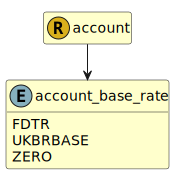

&lt;&nbsp; [Namespace](index.md)
#  fire.model.account_base_rate
>  
>The base rate represents the basis of the rate on the balance at the given date as agreed in the terms of the account.
> 

## Local Fields

| Name        | Description |
| ----------- | ----------- |
| FDTR |   |
| UKBRBASE |   |
| ZERO |   |

 

### Referenced from fields in:
-  [fire.model.account](UDT-fire.model.account.md)
