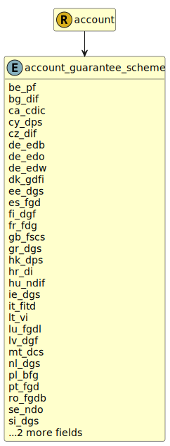

&lt;&nbsp; [Namespace](index.md)
#  fire.model.account_guarantee_scheme
>  
>The Government Deposit Scheme scheme under which the guarantee_amount is guaranteed.
> 

## Local Fields

| Name        | Description |
| ----------- | ----------- |
| be_pf |   |
| bg_dif |   |
| ca_cdic |   |
| cy_dps |   |
| cz_dif |   |
| de_edb |   |
| de_edo |   |
| de_edw |   |
| dk_gdfi |   |
| ee_dgs |   |
| es_fgd |   |
| fi_dgf |   |
| fr_fdg |   |
| gb_fscs |   |
| gr_dgs |   |
| hk_dps |   |
| hr_di |   |
| hu_ndif |   |
| ie_dgs |   |
| it_fitd |   |
| lt_vi |   |
| lu_fgdl |   |
| lv_dgf |   |
| mt_dcs |   |
| nl_dgs |   |
| pl_bfg |   |
| pt_fgd |   |
| ro_fgdb |   |
| se_ndo |   |
| si_dgs |   |
| sk_dpf |   |
| us_fdic |   |

 

### Referenced from fields in:
-  [fire.model.account](UDT-fire.model.account.md)
