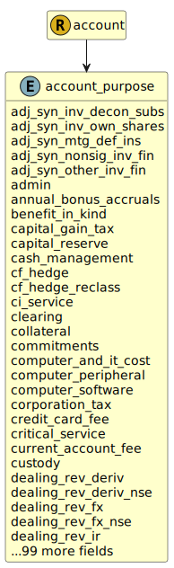

&lt;&nbsp; [Namespace](index.md)
#  fire.model.account_purpose
>  
>The purpose for which the account was created or is being used.
> 

## Local Fields

| Name        | Description |
| ----------- | ----------- |
| adj_syn_inv_decon_subs |   |
| adj_syn_inv_own_shares |   |
| adj_syn_mtg_def_ins |   |
| adj_syn_nonsig_inv_fin |   |
| adj_syn_other_inv_fin |   |
| admin |   |
| annual_bonus_accruals |   |
| benefit_in_kind |   |
| capital_gain_tax |   |
| capital_reserve |   |
| cash_management |   |
| cf_hedge |   |
| cf_hedge_reclass |   |
| ci_service |   |
| clearing |   |
| collateral |   |
| commitments |   |
| computer_and_it_cost |   |
| computer_peripheral |   |
| computer_software |   |
| corporation_tax |   |
| credit_card_fee |   |
| critical_service |   |
| current_account_fee |   |
| custody |   |
| dealing_rev_deriv |   |
| dealing_rev_deriv_nse |   |
| dealing_rev_fx |   |
| dealing_rev_fx_nse |   |
| dealing_rev_ir |   |
| dealing_rev_sec |   |
| dealing_rev_sec_nse |   |
| dealing_revenue |   |
| ded_fut_prof |   |
| ded_fut_prof_temp_diff |   |
| defined_benefit |   |
| deposit |   |
| derivative_fee |   |
| dgs_contribution |   |
| div_from_cis |   |
| div_from_money_mkt |   |
| dividend |   |
| donation |   |
| employee |   |
| employee_stock_option |   |
| escrow |   |
| fees |   |
| fine |   |
| firm_operating_expenses |   |
| firm_operations |   |
| furniture |   |
| fut_prof |   |
| fut_prof_temp_diff |   |
| fx |   |
| general_credit_risk |   |
| goodwill |   |
| insurance_fee |   |
| int_on_bond_and_frn |   |
| int_on_bridging_loan |   |
| int_on_credit_card |   |
| int_on_deposit |   |
| int_on_deriv_hedge |   |
| int_on_derivative |   |
| int_on_ecgd_lending |   |
| int_on_loan_and_adv |   |
| int_on_money_mkt |   |
| int_on_mortgage |   |
| int_on_sft |   |
| int_unallocated |   |
| interest |   |
| intra_group_fee |   |
| inv_in_subsidiary |   |
| investment_banking_fee |   |
| investment_property |   |
| ips |   |
| land |   |
| loan_and_advance_fee |   |
| machinery |   |
| manufactured_dividend |   |
| mortgage_fee |   |
| mtg_ins_nonconform |   |
| mtg_insurance |   |
| ni_contribution |   |
| non_life_ins_premium |   |
| not_fut_prof |   |
| occupancy_cost |   |
| operational |   |
| operational_escrow |   |
| operational_excess |   |
| oth_tax_excl_temp_diff |   |
| other |   |
| other_expenditure |   |
| other_fs_fee |   |
| other_non_fs_fee |   |
| other_social_contrib |   |
| other_staff_cost |   |
| other_staff_rem |   |
| overdraft_fee |   |
| own_property |   |
| pension |   |
| ppe |   |
| prime_brokerage |   |
| property |   |
| pv_future_spread_inc |   |
| rec_unidentified_cpty |   |
| reclass_tax |   |
| recovery |   |
| redundancy_pymt |   |
| reference |   |
| reg_loss |   |
| regular_wages |   |
| release |   |
| rent |   |
| res_fund_contribution |   |
| restructuring |   |
| retained_earnings |   |
| revaluation |   |
| revenue_reserve |   |
| share_plan |   |
| share_premium |   |
| staff |   |
| system |   |
| tax |   |
| telecom_equipment |   |
| third_party_interest |   |
| underwriting_fee |   |
| unsecured_loan_fee |   |
| vehicle |   |
| write_off |   |

 

### Referenced from fields in:
-  [fire.model.account](UDT-fire.model.account.md)
