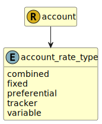

&lt;&nbsp; [Namespace](index.md)
#  fire.model.account_rate_type
>  
>Describes the type of interest rate applied to the account.
> 

## Local Fields

| Name        | Description |
| ----------- | ----------- |
| combined |   |
| fixed |   |
| preferential |   |
| tracker |   |
| variable |   |

 

### Referenced from fields in:
-  [fire.model.account](UDT-fire.model.account.md)
