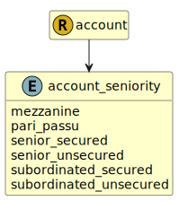

&lt;&nbsp; [Namespace](index.md)
#  fire.model.account_seniority
>  
>The seniority of the security in the event of sale or bankruptcy of the issuer.
> 

## Local Fields

| Name        | Description |
| ----------- | ----------- |
| mezzanine |   |
| pari_passu |   |
| senior_secured |   |
| senior_unsecured |   |
| subordinated_secured |   |
| subordinated_unsecured |   |

 

### Referenced from fields in:
-  [fire.model.account](UDT-fire.model.account.md)
