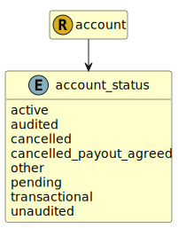

&lt;&nbsp; [Namespace](index.md)
#  fire.model.account_status
>  
>Describes if the Account is active or been cancelled.
> 

## Local Fields

| Name        | Description |
| ----------- | ----------- |
| active |   |
| audited |   |
| cancelled |   |
| cancelled_payout_agreed |   |
| other |   |
| pending |   |
| transactional |   |
| unaudited |   |

 

### Referenced from fields in:
-  [fire.model.account](UDT-fire.model.account.md)
