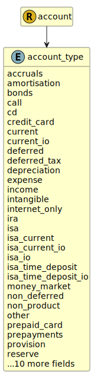

&lt;&nbsp; [Namespace](index.md)
#  fire.model.account_type
>  
>This is the type of the account with regards to common regulatory classifications.
> 

## Local Fields

| Name        | Description |
| ----------- | ----------- |
| accruals |   |
| amortisation |   |
| bonds |   |
| call |   |
| cd |   |
| credit_card |   |
| current |   |
| current_io |   |
| deferred |   |
| deferred_tax |   |
| depreciation |   |
| expense |   |
| income |   |
| intangible |   |
| internet_only |   |
| ira |   |
| isa |   |
| isa_current |   |
| isa_current_io |   |
| isa_io |   |
| isa_time_deposit |   |
| isa_time_deposit_io |   |
| money_market |   |
| non_deferred |   |
| non_product |   |
| other |   |
| prepaid_card |   |
| prepayments |   |
| provision |   |
| reserve |   |
| retail_bonds |   |
| savings |   |
| savings_io |   |
| suspense |   |
| tangible |   |
| third_party_savings |   |
| time_deposit |   |
| time_deposit_io |   |
| vostro |   |

 

### Referenced from fields in:
-  [fire.model.account](UDT-fire.model.account.md)
