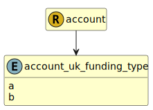

&lt;&nbsp; [Namespace](index.md)
#  fire.model.account_uk_funding_type
>  
>Funding type calculated according to BIPRU 12.5/12.6
> 

## Local Fields

| Name        | Description |
| ----------- | ----------- |
| a |   |
| b |   |

 

### Referenced from fields in:
-  [fire.model.account](UDT-fire.model.account.md)
