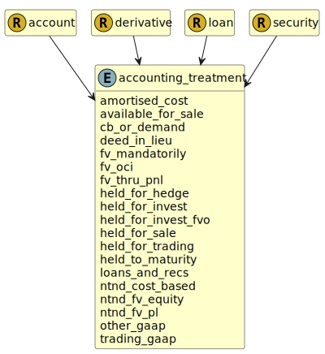

&lt;&nbsp; [Namespace](index.md)
#  fire.model.accounting_treatment
>  
>The accounting treatment in accordance with IAS/IFRS9 accounting principles.
> 

## Local Fields

| Name        | Description |
| ----------- | ----------- |
| amortised_cost |   |
| available_for_sale |   |
| cb_or_demand |   |
| deed_in_lieu |   |
| fv_mandatorily |   |
| fv_oci |   |
| fv_thru_pnl |   |
| held_for_hedge |   |
| held_for_invest |   |
| held_for_invest_fvo |   |
| held_for_sale |   |
| held_for_trading |   |
| held_to_maturity |   |
| loans_and_recs |   |
| ntnd_cost_based |   |
| ntnd_fv_equity |   |
| ntnd_fv_pl |   |
| other_gaap |   |
| trading_gaap |   |

 

### Referenced from fields in:
-  [fire.model.account](UDT-fire.model.account.md)
-  [fire.model.derivative](UDT-fire.model.derivative.md)
-  [fire.model.loan](UDT-fire.model.loan.md)
-  [fire.model.security](UDT-fire.model.security.md)
