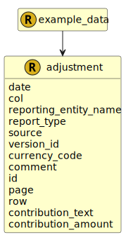

&lt;&nbsp; [Namespace](index.md)
#  fire.model.adjustment

## Local Fields

<table >
  <thead>
    <tr>
      <th>Name</th>
      <th>Datatype</th>
      <th>Description</th>
    </tr>
  </thead>
  <tbody>
    <tr>
        <td>date</td>
        <td><i>datetime</i> <b>?</b></td>
        <td>
The observation or value date for the data in this object. Formatted as YYYY-MM-DDTHH:MM:SSZ in accordance with ISO 8601.

</td>
    </tr>
    <tr>
        <td>col</td>
        <td><i>string</i> <b>?</b></td>
        <td>
The column of the report that this adjustment relates to.

</td>
    </tr>
    <tr>
        <td>reporting_entity_name</td>
        <td><i>string</i> <b>?</b></td>
        <td>
The name of the reporting legal entity for display purposes.

</td>
    </tr>
    <tr>
        <td>report_type</td>
        <td><i>string</i> <b>?</b></td>
        <td>
The report that this adjustment relates to.

</td>
    </tr>
    <tr>
        <td>source</td>
        <td><i>string</i> <b>?</b></td>
        <td>
The source(s) where this data originated. If more than one source needs to be stored for data lineage, it should be separated by a dash. eg. Source1-Source2

</td>
    </tr>
    <tr>
        <td>version_id</td>
        <td><i>string</i> <b>?</b></td>
        <td>
The version identifier of the data such as the firm's internal batch identifier.

</td>
    </tr>
    <tr>
        <td>currency_code</td>
        <td><i><a href='UDT-fire.model.currency_code.html'>&nbsp;fire.model.currency_code</a></i> <b>?</b></td>
        <td>
The currency of the contribution_amount in accordance with ISO 4217 standards.

</td>
    </tr>
    <tr>
        <td>comment</td>
        <td><i>string</i> <b>?</b></td>
        <td>
The description or commentary around the adjustment.

</td>
    </tr>
    <tr>
        <td>id</td>
        <td><i>string</i> <b>?</b></td>
        <td>
The unique identifier for the record within the firm.

</td>
    </tr>
    <tr>
        <td>page</td>
        <td><i>string</i> <b>?</b></td>
        <td>
The page of the report that this adjustment relates to.

</td>
    </tr>
    <tr>
        <td>row</td>
        <td><i>string</i> <b>?</b></td>
        <td>
The row of the report that this adjustment relates to.

</td>
    </tr>
    <tr>
        <td>contribution_text</td>
        <td><i>string</i> <b>?</b></td>
        <td>
The text to use for the adjustment where the reported cell is not a monetary value.

</td>
    </tr>
    <tr>
        <td>contribution_amount</td>
        <td><i>int</i> <b>?</b></td>
        <td>
The contribution amount this adjustment should make to the specified report cell. A positive/negative number in minor units (cents/pence).

</td>
    </tr>

  </tbody>
</table>
      

 

### Referenced from fields in:
-  [fire.model.example_data](UDT-fire.model.example_data.md)
