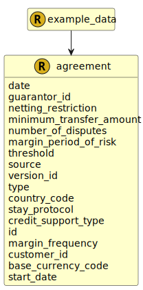

&lt;&nbsp; [Namespace](index.md)
#  fire.model.agreement
>  
>An agreement represents the standard terms agreed between two parties.
> 

## Local Fields

<table >
  <thead>
    <tr>
      <th>Name</th>
      <th>Datatype</th>
      <th>Description</th>
    </tr>
  </thead>
  <tbody>
    <tr>
        <td>date</td>
        <td>datetime</td>
        <td>
The observation or value date for the data in this object. Formatted as YYYY-MM-DDTHH:MM:SSZ in accordance with ISO 8601.

</td>
    </tr>
    <tr>
        <td>guarantor_id</td>
        <td><i>string</i> <b>?</b></td>
        <td>
The unique identifier used by the financial institution to identify the guarantor of the transactions covered by this agreement.

</td>
    </tr>
    <tr>
        <td>netting_restriction</td>
        <td><i><a href='UDT-fire.model.agreement_netting_restriction.html'>&nbsp;fire.model.agreement_netting_restriction</a></i> <b>?</b></td>
        <td>
populated only if any netting restriction applies, in relation to the nature of the agreement or the enforceability of netting in the jurisdiction of the counterparty, preventing the recognition of the agreement as risk-reducing, pursuant to CRR Articles 295 to 298

</td>
    </tr>
    <tr>
        <td>minimum_transfer_amount</td>
        <td><i>int</i> <b>?</b></td>
        <td>
Smallest amount of collateral that can be transferred. Monetary type represented as a naturally positive integer number of cents/pence.

</td>
    </tr>
    <tr>
        <td>number_of_disputes</td>
        <td><i>int</i> <b>?</b></td>
        <td>
Indicates the number of disputes threshold to be used in the margin period of risk

</td>
    </tr>
    <tr>
        <td>margin_period_of_risk</td>
        <td><i>int</i> <b>?</b></td>
        <td>
Margin period of risk estimated for the transactions covered by the [CSA] agreement

</td>
    </tr>
    <tr>
        <td>threshold</td>
        <td><i>int</i> <b>?</b></td>
        <td>
Amount below which collateral is not required. Monetary type represented as a naturally positive integer number of cents/pence.

</td>
    </tr>
    <tr>
        <td>source</td>
        <td><i>string</i> <b>?</b></td>
        <td>
The source where this data originated.

</td>
    </tr>
    <tr>
        <td>version_id</td>
        <td><i>string</i> <b>?</b></td>
        <td>
The version identifier of the data such as the firm's internal batch identifier.

</td>
    </tr>
    <tr>
        <td>type</td>
        <td><i><a href='UDT-fire.model.agreement_type.html'>&nbsp;fire.model.agreement_type</a></i> <b>?</b></td>
        <td>
The type of the master agreement.

</td>
    </tr>
    <tr>
        <td>country_code</td>
        <td><i><a href='UDT-fire.model.country_code.html'>&nbsp;fire.model.country_code</a></i> <b>?</b></td>
        <td>
The country code for the governing law of the agreement. Two-letter country code as defined according to ISO 3166-1.

</td>
    </tr>
    <tr>
        <td>stay_protocol</td>
        <td><i><a href='UDT-fire.model.agreement_stay_protocol.html'>&nbsp;fire.model.agreement_stay_protocol</a></i> <b>?</b></td>
        <td>
Indicates whether a stay protocol has been signed by one or both parties to the agreement.

</td>
    </tr>
    <tr>
        <td>credit_support_type</td>
        <td><i><a href='UDT-fire.model.agreement_credit_support_type.html'>&nbsp;fire.model.agreement_credit_support_type</a></i> <b>?</b></td>
        <td>
The type of credit support document

</td>
    </tr>
    <tr>
        <td>id</td>
        <td>string</td>
        <td>
The unique identifier for the record within the firm.

</td>
    </tr>
    <tr>
        <td>margin_frequency</td>
        <td><i><a href='UDT-fire.model.agreement_margin_frequency.html'>&nbsp;fire.model.agreement_margin_frequency</a></i> <b>?</b></td>
        <td>
Indicates the periodic timescale at which variation margin is exchanged. Cleared derivatives which are daily settled can be flagged as daily_settled.

</td>
    </tr>
    <tr>
        <td>customer_id</td>
        <td><i>string</i> <b>?</b></td>
        <td>
The unique identifier used by the financial institution to identify the counterparty to this agreement.

</td>
    </tr>
    <tr>
        <td>base_currency_code</td>
        <td><i><a href='UDT-fire.model.currency_code.html'>&nbsp;fire.model.currency_code</a></i> <b>?</b></td>
        <td>
Currency in accordance with ISO 4217. It should be consistent with minimum transfer amount and threshold.

</td>
    </tr>
    <tr>
        <td>start_date</td>
        <td><i>datetime</i> <b>?</b></td>
        <td>
The timestamp that the agreement commences. YYYY-MM-DDTHH:MM:SSZ in accordance with ISO 8601.

</td>
    </tr>

  </tbody>
</table>
      

 

### Referenced from fields in:
-  [fire.model.example_data](UDT-fire.model.example_data.md)
