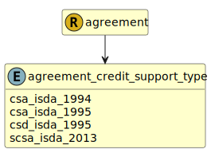

&lt;&nbsp; [Namespace](index.md)
#  fire.model.agreement_credit_support_type
>  
>The type of credit support document
> 

## Local Fields

| Name        | Description |
| ----------- | ----------- |
| csa_isda_1994 |   |
| csa_isda_1995 |   |
| csd_isda_1995 |   |
| scsa_isda_2013 |   |

 

### Referenced from fields in:
-  [fire.model.agreement](UDT-fire.model.agreement.md)
