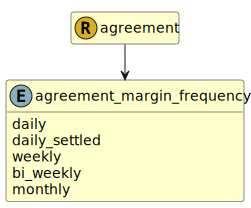

&lt;&nbsp; [Namespace](index.md)
#  fire.model.agreement_margin_frequency
>  
>Indicates the periodic timescale at which variation margin is exchanged. Cleared derivatives which are daily settled can be flagged as daily_settled.
> 

## Local Fields

| Name        | Description |
| ----------- | ----------- |
| daily |   |
| daily_settled |   |
| weekly |   |
| bi_weekly |   |
| monthly |   |

 

### Referenced from fields in:
-  [fire.model.agreement](UDT-fire.model.agreement.md)
