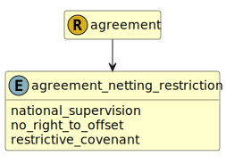

&lt;&nbsp; [Namespace](index.md)
#  fire.model.agreement_netting_restriction
>  
>populated only if any netting restriction applies, in relation to the nature of the agreement or the enforceability of netting in the jurisdiction of the counterparty, preventing the recognition of the agreement as risk-reducing, pursuant to CRR Articles 295 to 298
> 

## Local Fields

| Name        | Description |
| ----------- | ----------- |
| national_supervision |   |
| no_right_to_offset |   |
| restrictive_covenant |   |

 

### Referenced from fields in:
-  [fire.model.agreement](UDT-fire.model.agreement.md)
