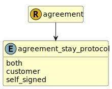

&lt;&nbsp; [Namespace](index.md)
#  fire.model.agreement_stay_protocol
>  
>Indicates whether a stay protocol has been signed by one or both parties to the agreement.
> 

## Local Fields

| Name        | Description |
| ----------- | ----------- |
| both |   |
| customer |   |
| self_signed |   |

 

### Referenced from fields in:
-  [fire.model.agreement](UDT-fire.model.agreement.md)
