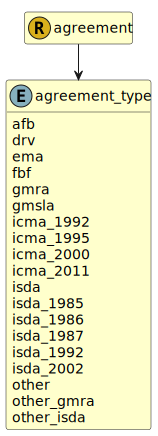

&lt;&nbsp; [Namespace](index.md)
#  fire.model.agreement_type
>  
>The type of the master agreement.
> 

## Local Fields

| Name        | Description |
| ----------- | ----------- |
| afb |   |
| drv |   |
| ema |   |
| fbf |   |
| gmra |   |
| gmsla |   |
| icma_1992 |   |
| icma_1995 |   |
| icma_2000 |   |
| icma_2011 |   |
| isda |   |
| isda_1985 |   |
| isda_1986 |   |
| isda_1987 |   |
| isda_1992 |   |
| isda_2002 |   |
| other |   |
| other_gmra |   |
| other_isda |   |

 

### Referenced from fields in:
-  [fire.model.agreement](UDT-fire.model.agreement.md)
