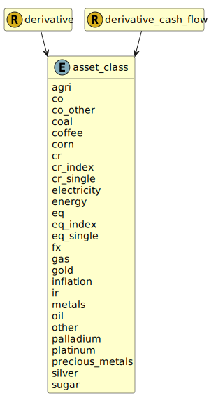

&lt;&nbsp; [Namespace](index.md)
#  fire.model.asset_class
>  
>The asset class to which the derivative belongs.
> 

## Local Fields

| Name        | Description |
| ----------- | ----------- |
| agri |   |
| co |   |
| co_other |   |
| coal |   |
| coffee |   |
| corn |   |
| cr |   |
| cr_index |   |
| cr_single |   |
| electricity |   |
| energy |   |
| eq |   |
| eq_index |   |
| eq_single |   |
| fx |   |
| gas |   |
| gold |   |
| inflation |   |
| ir |   |
| metals |   |
| oil |   |
| other |   |
| palladium |   |
| platinum |   |
| precious_metals |   |
| silver |   |
| sugar |   |

 

### Referenced from fields in:
-  [fire.model.derivative](UDT-fire.model.derivative.md)
-  [fire.model.derivative_cash_flow](UDT-fire.model.derivative_cash_flow.md)
