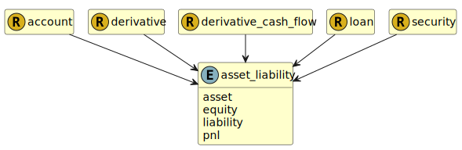

&lt;&nbsp; [Namespace](index.md)
#  fire.model.asset_liability
>  
>Is the data an asset, a liability, or equity on the firm's balance sheet?
> 

## Local Fields

| Name        | Description |
| ----------- | ----------- |
| asset |   |
| equity |   |
| liability |   |
| pnl |   |

 

### Referenced from fields in:
-  [fire.model.account](UDT-fire.model.account.md)
-  [fire.model.derivative](UDT-fire.model.derivative.md)
-  [fire.model.derivative_cash_flow](UDT-fire.model.derivative_cash_flow.md)
-  [fire.model.loan](UDT-fire.model.loan.md)
-  [fire.model.security](UDT-fire.model.security.md)
