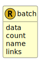

&lt;&nbsp; [Namespace](index.md)
#  fire.model.batch
>  
>FIRE schema for representing bulk collections of bank objects.
> 

## Local Fields

<table >
  <thead>
    <tr>
      <th>Name</th>
      <th>Datatype</th>
      <th>Description</th>
    </tr>
  </thead>
  <tbody>
    <tr>
        <td>data</td>
        <td>list< tuple< account : <a href='UDT-fire.model.account.html'>&nbsp;fire.model.account</a>, collateral : <a href='UDT-fire.model.collateral.html'>&nbsp;fire.model.collateral</a>, customer : <a href='UDT-fire.model.customer.html'>&nbsp;fire.model.customer</a>, derivative : <a href='UDT-fire.model.derivative.html'>&nbsp;fire.model.derivative</a>, derivative_cash_flow : <a href='UDT-fire.model.derivative_cash_flow.html'>&nbsp;fire.model.derivative_cash_flow</a>, exchange_rate : <a href='UDT-fire.model.exchange_rate.html'>&nbsp;fire.model.exchange_rate</a>, guarantor : <a href='UDT-fire.model.guarantor.html'>&nbsp;fire.model.guarantor</a>, issuer : <a href='UDT-fire.model.issuer.html'>&nbsp;fire.model.issuer</a>, loan : <a href='UDT-fire.model.loan.html'>&nbsp;fire.model.loan</a>, loan_transaction : <a href='UDT-fire.model.loan_transaction.html'>&nbsp;fire.model.loan_transaction</a>, security : <a href='UDT-fire.model.security.html'>&nbsp;fire.model.security</a> > ></td>
        <td>
An array of data items of a single type

</td>
    </tr>
    <tr>
        <td>count</td>
        <td><i>int(0, *)</i> <b>?</b></td>
        <td>
Number of records in this batch

</td>
    </tr>
    <tr>
        <td>name</td>
        <td>string</td>
        <td>
A unique identifier for the data batch

</td>
    </tr>
    <tr>
        <td>links</td>
        <td><i>list< <a href='UDT-fire.model.batch_links.html'>&nbsp;fire.model.batch_links</a> ></i> <b>?</b></td>
        <td>
An array describing the page structure of the full data batch

</td>
    </tr>

  </tbody>
</table>
      
