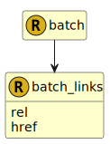

&lt;&nbsp; [Namespace](index.md)
#  fire.model.batch_links

## Local Fields

<table >
  <thead>
    <tr>
      <th>Name</th>
      <th>Datatype</th>
      <th>Description</th>
    </tr>
  </thead>
  <tbody>
    <tr>
        <td>rel</td>
        <td><a href='UDT-fire.model.batch_links_rel.html'>&nbsp;fire.model.batch_links_rel</a></td>
        <td></td>
    </tr>
    <tr>
        <td>href</td>
        <td>string</td>
        <td></td>
    </tr>

  </tbody>
</table>
      

 

### Referenced from fields in:
-  [fire.model.batch](UDT-fire.model.batch.md)
