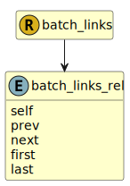

&lt;&nbsp; [Namespace](index.md)
#  fire.model.batch_links_rel

## Local Fields

| Name        | Description |
| ----------- | ----------- |
| self |   |
| prev |   |
| next |   |
| first |   |
| last |   |

 

### Referenced from fields in:
-  [fire.model.batch_links](UDT-fire.model.batch_links.md)
