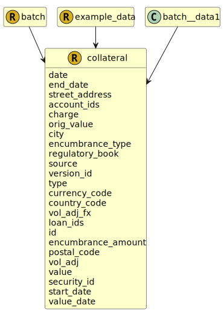

&lt;&nbsp; [Namespace](index.md)
#  fire.model.collateral
>  
>Data schema to define collateral (currently can reference loans or accounts).
> 

## Local Fields

<table >
  <thead>
    <tr>
      <th>Name</th>
      <th>Datatype</th>
      <th>Description</th>
    </tr>
  </thead>
  <tbody>
    <tr>
        <td>date</td>
        <td>datetime</td>
        <td>
The observation or value date for the data in this object. Formatted as YYYY-MM-DDTHH:MM:SSZ in accordance with ISO 8601.

</td>
    </tr>
    <tr>
        <td>end_date</td>
        <td><i>datetime</i> <b>?</b></td>
        <td>
The end date for recognition of the collateral

</td>
    </tr>
    <tr>
        <td>account_ids</td>
        <td><i>list< string ></i> <b>?</b></td>
        <td>
The unique identifier/s for the account/s within the financial institution.

</td>
    </tr>
    <tr>
        <td>charge</td>
        <td><i>int(0, *)</i> <b>?</b></td>
        <td>
Lender charge on collateral, 1 indicates first charge, 2 second and so on. 0 indicates a combination of charge levels.

</td>
    </tr>
    <tr>
        <td>orig_value</td>
        <td><i>int</i> <b>?</b></td>
        <td>
The valuation as used by the bank for the collateral at the origination of the related loan or line of credit. Monetary type represented as a naturally positive integer number of cents/pence.

</td>
    </tr>
    <tr>
        <td>encumbrance_type</td>
        <td><i><a href='UDT-fire.model.collateral_encumbrance_type.html'>&nbsp;fire.model.collateral_encumbrance_type</a></i> <b>?</b></td>
        <td>
The type of the encumbrance causing the encumbrance_amount.

</td>
    </tr>
    <tr>
        <td>regulatory_book</td>
        <td><i><a href='UDT-fire.model.regulatory_book.html'>&nbsp;fire.model.regulatory_book</a></i> <b>?</b></td>
        <td></td>
    </tr>
    <tr>
        <td>source</td>
        <td><i>string</i> <b>?</b></td>
        <td>
The source(s) where this data originated. If more than one source needs to be stored for data lineage, it should be separated by a dash. eg. Source1-Source2

</td>
    </tr>
    <tr>
        <td>version_id</td>
        <td><i>string</i> <b>?</b></td>
        <td>
The version identifier of the data such as the firm's internal batch identifier.

</td>
    </tr>
    <tr>
        <td>type</td>
        <td><i><a href='UDT-fire.model.collateral_type.html'>&nbsp;fire.model.collateral_type</a></i> <b>?</b></td>
        <td>
The collateral type defines the form of the collateral provided

</td>
    </tr>
    <tr>
        <td>currency_code</td>
        <td><i><a href='UDT-fire.model.currency_code.html'>&nbsp;fire.model.currency_code</a></i> <b>?</b></td>
        <td></td>
    </tr>
    <tr>
        <td>vol_adj_fx</td>
        <td><i>double</i> <b>?</b></td>
        <td>
The volatility adjustment appropriate to currency mismatch.

</td>
    </tr>
    <tr>
        <td>loan_ids</td>
        <td><i>list< string ></i> <b>?</b></td>
        <td>
The unique identifiers for the loans within the financial institution.

</td>
    </tr>
    <tr>
        <td>id</td>
        <td>string</td>
        <td>
The unique identifier for the record within the firm.

</td>
    </tr>
    <tr>
        <td>encumbrance_amount</td>
        <td><i>int</i> <b>?</b></td>
        <td>
The amount of the collateral that is encumbered by potential future commitments or legal liabilities. Monetary type represented as a naturally positive integer number of cents/pence.

</td>
    </tr>
    <tr>
        <td>vol_adj</td>
        <td><i>double</i> <b>?</b></td>
        <td>
The volatility adjustment appropriate to the collateral.

</td>
    </tr>
    <tr>
        <td>value</td>
        <td>int</td>
        <td>
The valuation as used by the bank for the collateral on the value_date. Monetary type represented as a naturally positive integer number of cents/pence.

</td>
    </tr>
    <tr>
        <td>security_id</td>
        <td><i>string</i> <b>?</b></td>
        <td>
The unique identifier used by the financial institution to identify the security representing collateral.

</td>
    </tr>
    <tr>
        <td>start_date</td>
        <td><i>datetime</i> <b>?</b></td>
        <td>
The start date for recognition of the collateral

</td>
    </tr>
    <tr>
        <td>value_date</td>
        <td><i>datetime</i> <b>?</b></td>
        <td>
The timestamp that the collateral was valued. YYYY-MM-DDTHH:MM:SSZ in accordance with ISO 8601.

</td>
    </tr>

  </tbody>
</table>
      

 

### Referenced from fields in:
-  [fire.model.batch](UDT-fire.model.batch.md)
-  [fire.model.example_data](UDT-fire.model.example_data.md)
