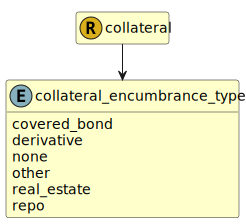

&lt;&nbsp; [Namespace](index.md)
#  fire.model.collateral_encumbrance_type
>  
>The type of the encumbrance causing the encumbrance_amount.
> 

## Local Fields

| Name        | Description |
| ----------- | ----------- |
| covered_bond |   |
| derivative |   |
| none |   |
| other |   |
| real_estate |   |
| repo |   |

 

### Referenced from fields in:
-  [fire.model.collateral](UDT-fire.model.collateral.md)
