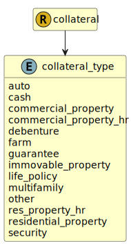

&lt;&nbsp; [Namespace](index.md)
#  fire.model.collateral_type
>  
>The collateral type defines the form of the collateral provided
> 

## Local Fields

| Name        | Description |
| ----------- | ----------- |
| auto |   |
| cash |   |
| commercial_property |   |
| commercial_property_hr |   |
| debenture |   |
| farm |   |
| guarantee |   |
| immovable_property |   |
| life_policy |   |
| multifamily |   |
| other |   |
| res_property_hr |   |
| residential_property |   |
| security |   |

 

### Referenced from fields in:
-  [fire.model.collateral](UDT-fire.model.collateral.md)
