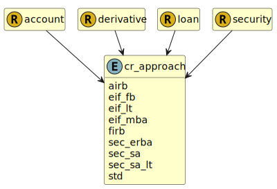

&lt;&nbsp; [Namespace](index.md)
#  fire.model.cr_approach
>  
>Specifies the approved credit risk rwa calculation approach to be applied to the exposure.
> 

## Local Fields

| Name        | Description |
| ----------- | ----------- |
| airb |   |
| eif_fb |   |
| eif_lt |   |
| eif_mba |   |
| firb |   |
| sec_erba |   |
| sec_sa |   |
| sec_sa_lt |   |
| std |   |

 

### Referenced from fields in:
-  [fire.model.account](UDT-fire.model.account.md)
-  [fire.model.derivative](UDT-fire.model.derivative.md)
-  [fire.model.loan](UDT-fire.model.loan.md)
-  [fire.model.security](UDT-fire.model.security.md)
