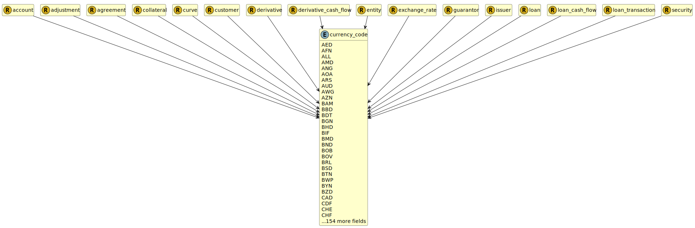

&lt;&nbsp; [Namespace](index.md)
#  fire.model.currency_code
>  
>Currency in accordance with ISO 4217 standards plus CNH for practical considerations.
> 

## Local Fields

| Name        | Description |
| ----------- | ----------- |
| AED |   |
| AFN |   |
| ALL |   |
| AMD |   |
| ANG |   |
| AOA |   |
| ARS |   |
| AUD |   |
| AWG |   |
| AZN |   |
| BAM |   |
| BBD |   |
| BDT |   |
| BGN |   |
| BHD |   |
| BIF |   |
| BMD |   |
| BND |   |
| BOB |   |
| BOV |   |
| BRL |   |
| BSD |   |
| BTN |   |
| BWP |   |
| BYN |   |
| BZD |   |
| CAD |   |
| CDF |   |
| CHE |   |
| CHF |   |
| CHW |   |
| CLF |   |
| CLP |   |
| CNH |   |
| CNY |   |
| COP |   |
| COU |   |
| CRC |   |
| CUC |   |
| CUP |   |
| CVE |   |
| CZK |   |
| DJF |   |
| DKK |   |
| DOP |   |
| DZD |   |
| EGP |   |
| ERN |   |
| ETB |   |
| EUR |   |
| FJD |   |
| FKP |   |
| GBP |   |
| GEL |   |
| GHS |   |
| GIP |   |
| GMD |   |
| GNF |   |
| GTQ |   |
| GYD |   |
| HKD |   |
| HNL |   |
| HRK |   |
| HTG |   |
| HUF |   |
| IDR |   |
| ILS |   |
| INR |   |
| IQD |   |
| IRR |   |
| ISK |   |
| JMD |   |
| JOD |   |
| JPY |   |
| KES |   |
| KGS |   |
| KHR |   |
| KMF |   |
| KPW |   |
| KRW |   |
| KWD |   |
| KYD |   |
| KZT |   |
| LAK |   |
| LBP |   |
| LKR |   |
| LRD |   |
| LSL |   |
| LYD |   |
| MAD |   |
| MDL |   |
| MGA |   |
| MKD |   |
| MMK |   |
| MNT |   |
| MOP |   |
| MRU |   |
| MUR |   |
| MVR |   |
| MWK |   |
| MXN |   |
| MXV |   |
| MYR |   |
| MZN |   |
| NAD |   |
| NGN |   |
| NIO |   |
| NOK |   |
| NPR |   |
| NZD |   |
| OMR |   |
| PAB |   |
| PEN |   |
| PGK |   |
| PHP |   |
| PKR |   |
| PLN |   |
| PYG |   |
| QAR |   |
| RON |   |
| RSD |   |
| RUB |   |
| RWF |   |
| SAR |   |
| SBD |   |
| SCR |   |
| SDG |   |
| SEK |   |
| SGD |   |
| SHP |   |
| SLL |   |
| SOS |   |
| SRD |   |
| SSP |   |
| STN |   |
| SYP |   |
| SZL |   |
| THB |   |
| TJS |   |
| TMT |   |
| TND |   |
| TOP |   |
| TRY |   |
| TTD |   |
| TWD |   |
| TZS |   |
| UAH |   |
| UGX |   |
| USD |   |
| USN |   |
| USS |   |
| UYI |   |
| UYU |   |
| UYW |   |
| UZS |   |
| VES |   |
| VND |   |
| VUV |   |
| WST |   |
| XAF |   |
| XAG |   |
| XAU |   |
| XBA |   |
| XBB |   |
| XBC |   |
| XBD |   |
| XCD |   |
| XDR |   |
| XOF |   |
| XPD |   |
| XPF |   |
| XPT |   |
| XSU |   |
| XTS |   |
| XUA |   |
| XXX |   |
| YER |   |
| ZAR |   |
| ZMW |   |

  
Referenced from fields in:

  -  [fire.model.account](UDT-fire.model.account.md)
-  [fire.model.adjustment](UDT-fire.model.adjustment.md)
-  [fire.model.agreement](UDT-fire.model.agreement.md)
-  [fire.model.collateral](UDT-fire.model.collateral.md)
-  [fire.model.curve](UDT-fire.model.curve.md)
-  [fire.model.customer](UDT-fire.model.customer.md)
-  [fire.model.derivative](UDT-fire.model.derivative.md)
-  [fire.model.derivative_cash_flow](UDT-fire.model.derivative_cash_flow.md)
-  [fire.model.entity](UDT-fire.model.entity.md)
-  [fire.model.exchange_rate](UDT-fire.model.exchange_rate.md)
-  [fire.model.guarantor](UDT-fire.model.guarantor.md)
-  [fire.model.issuer](UDT-fire.model.issuer.md)
-  [fire.model.loan](UDT-fire.model.loan.md)
-  [fire.model.loan_cash_flow](UDT-fire.model.loan_cash_flow.md)
-  [fire.model.loan_transaction](UDT-fire.model.loan_transaction.md)
-  [fire.model.security](UDT-fire.model.security.md)

            
