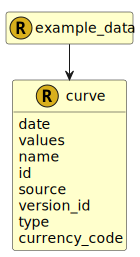

&lt;&nbsp; [Namespace](index.md)
#  fire.model.curve
>  
>A Curve represents a series of points on a plot. Typically, interest rates, volatility or forward prices.
> 

## Local Fields

<table >
  <thead>
    <tr>
      <th>Name</th>
      <th>Datatype</th>
      <th>Description</th>
    </tr>
  </thead>
  <tbody>
    <tr>
        <td>date</td>
        <td>datetime</td>
        <td>
The observation or value date for the data in this object. Formatted as YYYY-MM-DDTHH:MM:SSZ in accordance with ISO 8601.

</td>
    </tr>
    <tr>
        <td>values</td>
        <td>set< <a href='UDT-fire.model.curve_values.html'>&nbsp;fire.model.curve_values</a> ></td>
        <td>
The list of values for this curve.

</td>
    </tr>
    <tr>
        <td>name</td>
        <td><i>string</i> <b>?</b></td>
        <td>
The internal name of the curve.

</td>
    </tr>
    <tr>
        <td>id</td>
        <td>string</td>
        <td>
The unique identifier for the record within the firm.

</td>
    </tr>
    <tr>
        <td>source</td>
        <td><i>string</i> <b>?</b></td>
        <td>
The source(s) where this data originated. If more than one source needs to be stored for data lineage, it should be separated by a dash. eg. Source1-Source2

</td>
    </tr>
    <tr>
        <td>version_id</td>
        <td><i>string</i> <b>?</b></td>
        <td>
The version identifier of the data such as the firm's internal batch identifier.

</td>
    </tr>
    <tr>
        <td>type</td>
        <td><i><a href='UDT-fire.model.curve_type.html'>&nbsp;fire.model.curve_type</a></i> <b>?</b></td>
        <td>
The curve type.

</td>
    </tr>
    <tr>
        <td>currency_code</td>
        <td><i><a href='UDT-fire.model.currency_code.html'>&nbsp;fire.model.currency_code</a></i> <b>?</b></td>
        <td>
The currency reference code in accordance with ISO 4217 standards.

</td>
    </tr>

  </tbody>
</table>
      

 

### Referenced from fields in:
-  [fire.model.example_data](UDT-fire.model.example_data.md)
