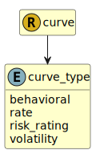

&lt;&nbsp; [Namespace](index.md)
#  fire.model.curve_type
>  
>The curve type.
> 

## Local Fields

| Name        | Description |
| ----------- | ----------- |
| behavioral |   |
| rate |   |
| risk_rating |   |
| volatility |   |

 

### Referenced from fields in:
-  [fire.model.curve](UDT-fire.model.curve.md)
