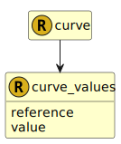

&lt;&nbsp; [Namespace](index.md)
#  fire.model.curve_values

## Local Fields

<table >
  <thead>
    <tr>
      <th>Name</th>
      <th>Datatype</th>
      <th>Description</th>
    </tr>
  </thead>
  <tbody>
    <tr>
        <td>reference</td>
        <td><a href='UDT-fire.model.curve_values_reference.html'>&nbsp;fire.model.curve_values_reference</a></td>
        <td>
The reference item for the value. (x-axis)

</td>
    </tr>
    <tr>
        <td>value</td>
        <td>double</td>
        <td>
The reference value for this rate. (y-axis)

</td>
    </tr>

  </tbody>
</table>
      

 

### Referenced from fields in:
-  [fire.model.curve](UDT-fire.model.curve.md)
