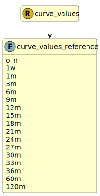

&lt;&nbsp; [Namespace](index.md)
#  fire.model.curve_values_reference
>  
>The reference item for the value. (x-axis)
> 

## Local Fields

| Name        | Description |
| ----------- | ----------- |
| o_n |   |
| 1w |   |
| 1m |   |
| 3m |   |
| 6m |   |
| 12m |   |
| 24m |   |
| 60m |   |
| 120m |   |

 

### Referenced from fields in:
-  [fire.model.curve_values](UDT-fire.model.curve_values.md)
