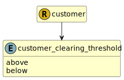

&lt;&nbsp; [Namespace](index.md)
#  fire.model.customer_clearing_threshold
>  
>Status of the clearing threshold as defined in EMIR
> 

## Local Fields

| Name        | Description |
| ----------- | ----------- |
| above |   |
| below |   |

 

### Referenced from fields in:
-  [fire.model.customer](UDT-fire.model.customer.md)
