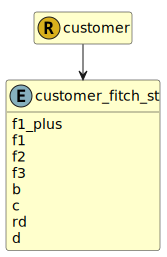

&lt;&nbsp; [Namespace](index.md)
#  fire.model.customer_fitch_st
>  
>Fitch short term credit ratings
> 

## Local Fields

| Name        | Description |
| ----------- | ----------- |
| f1_plus |   |
| f1 |   |
| f2 |   |
| f3 |   |
| b |   |
| c |   |
| rd |   |
| d |   |

 

### Referenced from fields in:
-  [fire.model.customer](UDT-fire.model.customer.md)
