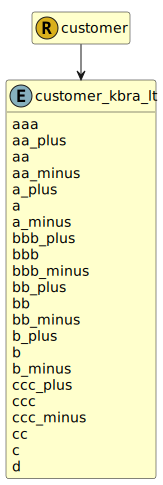

&lt;&nbsp; [Namespace](index.md)
#  fire.model.customer_kbra_lt
>  
>KBRA long term credit ratings
> 

## Local Fields

| Name        | Description |
| ----------- | ----------- |
| aaa |   |
| aa_plus |   |
| aa |   |
| aa_minus |   |
| a_plus |   |
| a |   |
| a_minus |   |
| bbb_plus |   |
| bbb |   |
| bbb_minus |   |
| bb_plus |   |
| bb |   |
| bb_minus |   |
| b_plus |   |
| b |   |
| b_minus |   |
| ccc_plus |   |
| ccc |   |
| ccc_minus |   |
| cc |   |
| c |   |
| d |   |

 

### Referenced from fields in:
-  [fire.model.customer](UDT-fire.model.customer.md)
