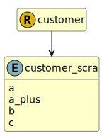

&lt;&nbsp; [Namespace](index.md)
#  fire.model.customer_scra
>  
>Grade calculated using the Basel Standardised Credit Risk Assessment
> 

## Local Fields

| Name        | Description |
| ----------- | ----------- |
| a |   |
| a_plus |   |
| b |   |
| c |   |

 

### Referenced from fields in:
-  [fire.model.customer](UDT-fire.model.customer.md)
