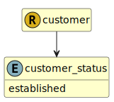

&lt;&nbsp; [Namespace](index.md)
#  fire.model.customer_status
>  
>The status of the relationship with the customer from the firm's point of view.
> 

## Local Fields

| Name        | Description |
| ----------- | ----------- |
| established |   |

 

### Referenced from fields in:
-  [fire.model.customer](UDT-fire.model.customer.md)
