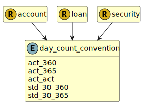

&lt;&nbsp; [Namespace](index.md)
#  fire.model.day_count_convention
>  
>The methodology for calculating the number of days between two dates. It is used to calculate the amount of accrued interest or the present value.
> 

## Local Fields

| Name        | Description |
| ----------- | ----------- |
| act_360 |   |
| act_365 |   |
| act_act |   |
| std_30_360 |   |
| std_30_365 |   |

 

### Referenced from fields in:
-  [fire.model.account](UDT-fire.model.account.md)
-  [fire.model.loan](UDT-fire.model.loan.md)
-  [fire.model.security](UDT-fire.model.security.md)
