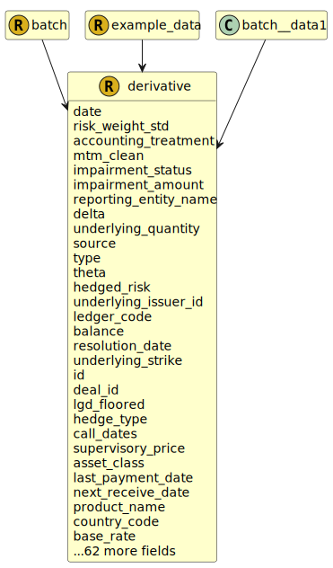

&lt;&nbsp; [Namespace](index.md)
#  fire.model.derivative
>  
>A derivative is a contract which derives its value from an underlying reference index, security or asset.
> 

## Local Fields

<table >
  <thead>
    <tr>
      <th>Name</th>
      <th>Datatype</th>
      <th>Description</th>
    </tr>
  </thead>
  <tbody>
    <tr>
        <td>date</td>
        <td>datetime</td>
        <td>
The observation or value date for the data in this object. Formatted as YYYY-MM-DDTHH:MM:SSZ in accordance with ISO 8601.

</td>
    </tr>
    <tr>
        <td>risk_weight_std</td>
        <td><i>double</i> <b>?</b></td>
        <td>
The standardised approach risk weight represented as a decimal/float such that 1.5% is 0.015.

</td>
    </tr>
    <tr>
        <td>accounting_treatment</td>
        <td><i><a href='UDT-fire.model.accounting_treatment.html'>&nbsp;fire.model.accounting_treatment</a></i> <b>?</b></td>
        <td></td>
    </tr>
    <tr>
        <td>mtm_clean</td>
        <td><i>int</i> <b>?</b></td>
        <td>
The mark-to-market value of the derivative excluding interest. Monetary type represented as a naturally positive integer number of cents/pence.

</td>
    </tr>
    <tr>
        <td>impairment_status</td>
        <td><i><a href='UDT-fire.model.impairment_status.html'>&nbsp;fire.model.impairment_status</a></i> <b>?</b></td>
        <td></td>
    </tr>
    <tr>
        <td>impairment_amount</td>
        <td><i>int(0, *)</i> <b>?</b></td>
        <td>
The impairment amount for a security is the allowance set aside by the firm for losses.

</td>
    </tr>
    <tr>
        <td>reporting_entity_name</td>
        <td><i>string</i> <b>?</b></td>
        <td>
The name of the reporting legal entity for display purposes.

</td>
    </tr>
    <tr>
        <td>delta</td>
        <td><i>double</i> <b>?</b></td>
        <td>
Price sensitivity to the underlying.

</td>
    </tr>
    <tr>
        <td>underlying_quantity</td>
        <td><i>double</i> <b>?</b></td>
        <td>
Number of underlying units related to the underlying_price

</td>
    </tr>
    <tr>
        <td>source</td>
        <td><i>string</i> <b>?</b></td>
        <td>
The source(s) where this data originated. If more than one source needs to be stored for data lineage, it should be separated by a dash. eg. Source1-Source2

</td>
    </tr>
    <tr>
        <td>type</td>
        <td><i><a href='UDT-fire.model.derivative_type.html'>&nbsp;fire.model.derivative_type</a></i> <b>?</b></td>
        <td>
This is the type of the derivative with regards to common regulatory classifications.

</td>
    </tr>
    <tr>
        <td>theta</td>
        <td><i>double</i> <b>?</b></td>
        <td>
Price sensitivity with respect to time.

</td>
    </tr>
    <tr>
        <td>underlying_issuer_id</td>
        <td><i>string</i> <b>?</b></td>
        <td>
The unique identifier used by the financial institution to identify the underlying reference issuer for this derivative.

</td>
    </tr>
    <tr>
        <td>ledger_code</td>
        <td><i>string</i> <b>?</b></td>
        <td>
The internal ledger code or line item name.

</td>
    </tr>
    <tr>
        <td>balance</td>
        <td><i>int</i> <b>?</b></td>
        <td>
Outstanding amount including accrued interest. Monetary type represented as a naturally positive integer number of cents/pence.

</td>
    </tr>
    <tr>
        <td>underlying_strike</td>
        <td><i>double</i> <b>?</b></td>
        <td>
Strike price of the option, which is compared to the underlying price on the option exercise date.

</td>
    </tr>
    <tr>
        <td>id</td>
        <td>string</td>
        <td>
The unique identifier for the record within the firm.

</td>
    </tr>
    <tr>
        <td>deal_id</td>
        <td><i>string</i> <b>?</b></td>
        <td>
The unique identifier used by the financial institution for the deal to which this derivative belongs.

</td>
    </tr>
    <tr>
        <td>lgd_floored</td>
        <td><i>double(0.0, 1.0)</i> <b>?</b></td>
        <td>
The final LGD value after the relevant floors have been applied. To be used in the IRB RWA calculations.

</td>
    </tr>
    <tr>
        <td>call_dates</td>
        <td><i>list< datetime ></i> <b>?</b></td>
        <td>
Dates where this contract can be called (by the customer). Formatted as YYYY-MM-DDTHH:MM:SSZ in accordance with ISO 8601.

</td>
    </tr>
    <tr>
        <td>supervisory_price</td>
        <td><i>double</i> <b>?</b></td>
        <td>
Current price/value of the underlying of an option when different from underlying_price, e.g. for Asian-style options.

</td>
    </tr>
    <tr>
        <td>asset_class</td>
        <td><i><a href='UDT-fire.model.asset_class.html'>&nbsp;fire.model.asset_class</a></i> <b>?</b></td>
        <td></td>
    </tr>
    <tr>
        <td>last_payment_date</td>
        <td><i>datetime</i> <b>?</b></td>
        <td>
The final payment date for interest payments, often coincides with end_date.

</td>
    </tr>
    <tr>
        <td>next_receive_date</td>
        <td><i>datetime</i> <b>?</b></td>
        <td>
The next date at which interest will be received or accrued_interest balance returned to zero.

</td>
    </tr>
    <tr>
        <td>product_name</td>
        <td><i>string</i> <b>?</b></td>
        <td>
The name of the product as given by the financial institution to be used for display and reference purposes.

</td>
    </tr>
    <tr>
        <td>country_code</td>
        <td><i><a href='UDT-fire.model.country_code.html'>&nbsp;fire.model.country_code</a></i> <b>?</b></td>
        <td>
Two-letter country code for derivative location/jurisdiction. In accordance with ISO 3166-1.

</td>
    </tr>
    <tr>
        <td>base_rate</td>
        <td><i><a href='UDT-fire.model.derivative_base_rate.html'>&nbsp;fire.model.derivative_base_rate</a></i> <b>?</b></td>
        <td>
The base rate represents the basis of the rate on the balance at the given date as agreed in the terms of the financial product.

</td>
    </tr>
    <tr>
        <td>underlying_security_id</td>
        <td><i>string</i> <b>?</b></td>
        <td>
The unique identifier used by the financial institution to identify the underlying reference security for this derivative.

</td>
    </tr>
    <tr>
        <td>asset_liability</td>
        <td><i><a href='UDT-fire.model.asset_liability.html'>&nbsp;fire.model.asset_liability</a></i> <b>?</b></td>
        <td></td>
    </tr>
    <tr>
        <td>position</td>
        <td><i><a href='UDT-fire.model.derivative_position.html'>&nbsp;fire.model.derivative_position</a></i> <b>?</b></td>
        <td>
Specifies the market position, i.e. long or short, of the derivative leg

</td>
    </tr>
    <tr>
        <td>first_payment_date</td>
        <td><i>datetime</i> <b>?</b></td>
        <td>
The first payment date for interest payments.

</td>
    </tr>
    <tr>
        <td>cost_center_code</td>
        <td><i>string</i> <b>?</b></td>
        <td>
The organizational unit or sub-unit to which costs/profits are booked.

</td>
    </tr>
    <tr>
        <td>settlement_type</td>
        <td><i><a href='UDT-fire.model.derivative_settlement_type.html'>&nbsp;fire.model.derivative_settlement_type</a></i> <b>?</b></td>
        <td>
The type of settlement for the contract.

</td>
    </tr>
    <tr>
        <td>status</td>
        <td><i><a href='UDT-fire.model.derivative_status.html'>&nbsp;fire.model.derivative_status</a></i> <b>?</b></td>
        <td>
Provides additional information regarding the status of the derivative.

</td>
    </tr>
    <tr>
        <td>end_date</td>
        <td><i>datetime</i> <b>?</b></td>
        <td>
YYYY-MM-DDTHH:MM:SSZ in accordance with ISO 8601

</td>
    </tr>
    <tr>
        <td>initial_margin</td>
        <td><i>int</i> <b>?</b></td>
        <td>
Upfront margin posted/received for the trade. Monetary type as integer number of cents.

</td>
    </tr>
    <tr>
        <td>mic_code</td>
        <td><i>string(4, 4)</i> <b>?</b></td>
        <td></td>
    </tr>
    <tr>
        <td>pd_irb</td>
        <td><i>double(0.0, 1.0)</i> <b>?</b></td>
        <td>
The probability of default as determined by internal rating-based methods, represented as a number between 0 and 1.

</td>
    </tr>
    <tr>
        <td>leg_type</td>
        <td><i><a href='UDT-fire.model.derivative_leg_type.html'>&nbsp;fire.model.derivative_leg_type</a></i> <b>?</b></td>
        <td>
Describe the payoff type of the derivative leg.

</td>
    </tr>
    <tr>
        <td>purpose</td>
        <td><i><a href='UDT-fire.model.derivative_purpose.html'>&nbsp;fire.model.derivative_purpose</a></i> <b>?</b></td>
        <td>
The purpose for which the derivative is being held.

</td>
    </tr>
    <tr>
        <td>risk_country_code</td>
        <td><i><a href='UDT-fire.model.country_code.html'>&nbsp;fire.model.country_code</a></i> <b>?</b></td>
        <td>
Two-letter country code describing where the risk for the derivative product resides. In accordance with ISO 3166-1

</td>
    </tr>
    <tr>
        <td>fvh_level</td>
        <td><i>int(1, 3)</i> <b>?</b></td>
        <td>
Fair value hierarchy category according to IFRS 13.93 (b)

</td>
    </tr>
    <tr>
        <td>underlying_derivative_id</td>
        <td><i>string</i> <b>?</b></td>
        <td>
The unique identifier used by the financial institution to identify the underlying reference derivative for this derivative.

</td>
    </tr>
    <tr>
        <td>notional_amount</td>
        <td><i>int</i> <b>?</b></td>
        <td>
The notional value is the total value with regard to a derivative's underlying index, security or asset at its spot price in accordance with the specifications (i.e. leverage) of the derivative product. Monetary type represented as a naturally positive integer number of cents/pence.

</td>
    </tr>
    <tr>
        <td>implied_vol</td>
        <td><i>double</i> <b>?</b></td>
        <td>
Options: implied volatility used to compute mtm and greeks.

</td>
    </tr>
    <tr>
        <td>regulatory_book</td>
        <td><i><a href='UDT-fire.model.regulatory_book.html'>&nbsp;fire.model.regulatory_book</a></i> <b>?</b></td>
        <td></td>
    </tr>
    <tr>
        <td>risk_weight_irb</td>
        <td><i>double</i> <b>?</b></td>
        <td>
The internal risk weight represented as a decimal/float such that 1.5% is 0.015.

</td>
    </tr>
    <tr>
        <td>currency_code</td>
        <td><i><a href='UDT-fire.model.currency_code.html'>&nbsp;fire.model.currency_code</a></i> <b>?</b></td>
        <td>
Actual currency of the underlying reference index, security or asset for the derivative in accordance with ISO 4217 standards. It should be consistent with balance, accrued_interest, guarantee_amount and other monetary amounts.

</td>
    </tr>
    <tr>
        <td>next_payment_date</td>
        <td><i>datetime</i> <b>?</b></td>
        <td>
The next date at which interest will be paid or accrued_interest balance returned to zero.

</td>
    </tr>
    <tr>
        <td>underlying_index</td>
        <td><i>string</i> <b>?</b></td>
        <td>
The name of a derivative contract underlying which can be used for all derivative asset classes (e.g. interest rate index, credit index, equity index

</td>
    </tr>
    <tr>
        <td>on_balance_sheet</td>
        <td><i>boolean</i> <b>?</b></td>
        <td>
Is the derivative reported on the balance sheet of the financial institution?

</td>
    </tr>
    <tr>
        <td>rate</td>
        <td><i>double</i> <b>?</b></td>
        <td>
The full interest rate applied to the derivative notional in percentage terms. Note that this therefore includes the base_rate (ie. not the spread).

</td>
    </tr>
    <tr>
        <td>insolvency_rank</td>
        <td><i>int(1, *)</i> <b>?</b></td>
        <td>
The insolvency ranking as per the national legal framework of the reporting institution.

</td>
    </tr>
    <tr>
        <td>ccr_approach</td>
        <td><i><a href='UDT-fire.model.derivative_ccr_approach.html'>&nbsp;fire.model.derivative_ccr_approach</a></i> <b>?</b></td>
        <td>
Specifies the approved counterparty credit risk methodology for calculating exposures.

</td>
    </tr>
    <tr>
        <td>cr_approach</td>
        <td><i><a href='UDT-fire.model.cr_approach.html'>&nbsp;fire.model.cr_approach</a></i> <b>?</b></td>
        <td>
Specifies the approved credit risk rwa calculation approach to be applied to the exposure.

</td>
    </tr>
    <tr>
        <td>csa_id</td>
        <td><i>string</i> <b>?</b></td>
        <td>
The unique identifier of the credit support annex for this derivative

</td>
    </tr>
    <tr>
        <td>prev_payment_date</td>
        <td><i>datetime</i> <b>?</b></td>
        <td>
The most recent previous date at which interest was paid or accrued_interest balance returned to zero.

</td>
    </tr>
    <tr>
        <td>next_exercise_date</td>
        <td><i>datetime</i> <b>?</b></td>
        <td>
The next date at which the option can be exercised.

</td>
    </tr>
    <tr>
        <td>break_dates</td>
        <td><i>list< datetime ></i> <b>?</b></td>
        <td>
Dates where this contract can be broken (by either party). Formatted as YYYY-MM-DDTHH:MM:SSZ in accordance with ISO 8601.

</td>
    </tr>
    <tr>
        <td>last_exercise_date</td>
        <td><i>datetime</i> <b>?</b></td>
        <td>
The last date on which an option can be exercised. For European options, it is the option exercise date

</td>
    </tr>
    <tr>
        <td>start_date</td>
        <td><i>datetime</i> <b>?</b></td>
        <td>
Contract effective or commencement date; security issue date. Format YYYY-MM-DDTHH:MM:SSZ in accordance with ISO 8601.

</td>
    </tr>
    <tr>
        <td>underlying_index_tenor</td>
        <td><i><a href='UDT-fire.model.derivative_underlying_index_tenor.html'>&nbsp;fire.model.derivative_underlying_index_tenor</a></i> <b>?</b></td>
        <td>
The designated maturity of the underlying interest rate index used in the underlying_index property for interest rate derivatives

</td>
    </tr>
    <tr>
        <td>mna_id</td>
        <td><i>string</i> <b>?</b></td>
        <td>
The unique identifier of the Master Netting Agreement for this derivative

</td>
    </tr>
    <tr>
        <td>underlying_price</td>
        <td><i>double</i> <b>?</b></td>
        <td>
Current price/value of the underlying.

</td>
    </tr>
    <tr>
        <td>strike</td>
        <td><i>double</i> <b>?</b></td>
        <td>
Strike price of the option, which is compared to the underlying price on the option exercise date.

</td>
    </tr>
    <tr>
        <td>reporting_id</td>
        <td><i>string</i> <b>?</b></td>
        <td>
The internal ID for the legal entity under which the account is being reported.

</td>
    </tr>
    <tr>
        <td>version_id</td>
        <td><i>string</i> <b>?</b></td>
        <td>
The version identifier of the data such as the firm's internal batch identifier.

</td>
    </tr>
    <tr>
        <td>trade_date</td>
        <td><i>datetime</i> <b>?</b></td>
        <td>
The timestamp that the trade or financial product terms are agreed. YYYY-MM-DDTHH:MM:SSZ in accordance with ISO 8601.

</td>
    </tr>
    <tr>
        <td>lgd_irb</td>
        <td><i>double(0.0, 1.0)</i> <b>?</b></td>
        <td>
The loss given default as determined by internal rating-based methods, represented as a number between 0 and 1.

</td>
    </tr>
    <tr>
        <td>next_receive_amount</td>
        <td><i>int</i> <b>?</b></td>
        <td>
The amount that is expected to be received at the next_receive_date. Monetary type represented as a naturally positive integer number of cents/pence.

</td>
    </tr>
    <tr>
        <td>next_reset_date</td>
        <td><i>datetime</i> <b>?</b></td>
        <td>
The date on which the periodic payment term and conditions of a contract agreement are reset/re-established.

</td>
    </tr>
    <tr>
        <td>mtm_dirty</td>
        <td><i>int</i> <b>?</b></td>
        <td>
The mark-to-market value of the derivative including interest. Monetary type represented as a naturally positive integer number of cents/pence.

</td>
    </tr>
    <tr>
        <td>rho</td>
        <td><i>double</i> <b>?</b></td>
        <td>
Price sensitivity to interest rates.

</td>
    </tr>
    <tr>
        <td>accrued_interest</td>
        <td><i>int</i> <b>?</b></td>
        <td>
The accrued interest since the last payment date and due at the next payment date. Monetary type represented as a naturally positive integer number of cents/pence.

</td>
    </tr>
    <tr>
        <td>customer_id</td>
        <td><i>string</i> <b>?</b></td>
        <td>
The unique identifier used by the financial institution to identify the customer for this product.

</td>
    </tr>
    <tr>
        <td>gamma</td>
        <td><i>double</i> <b>?</b></td>
        <td>
Second-order price sensitivity to the underlying or rate of change of the delta.

</td>
    </tr>
    <tr>
        <td>underlying_currency_code</td>
        <td><i><a href='UDT-fire.model.currency_code.html'>&nbsp;fire.model.currency_code</a></i> <b>?</b></td>
        <td>
Currency of the underlying which should be in line with ISO 4217 standards.

</td>
    </tr>
    <tr>
        <td>vega</td>
        <td><i>double</i> <b>?</b></td>
        <td>
Price sensitivity to volatility.

</td>
    </tr>
    <tr>
        <td>next_payment_amount</td>
        <td><i>int</i> <b>?</b></td>
        <td>
The amount that will need to be paid at the next_payment_date. Monetary type represented as a naturally positive integer number of cents/pence.

</td>
    </tr>
    <tr>
        <td>value_date</td>
        <td><i>datetime</i> <b>?</b></td>
        <td>
The timestamp that the derivative was valued. YYYY-MM-DDTHH:MM:SSZ in accordance with ISO 8601.

</td>
    </tr>

  </tbody>
</table>
      

 

### Referenced from fields in:
-  [fire.model.batch](UDT-fire.model.batch.md)
-  [fire.model.example_data](UDT-fire.model.example_data.md)
