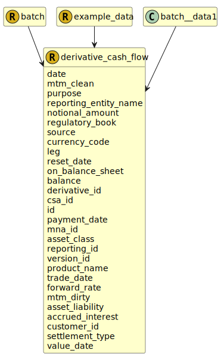

&lt;&nbsp; [Namespace](index.md)
#  fire.model.derivative_cash_flow
>  
>A derivative cash flow where two parties exchange cash flows (or assets) derived from an underlying reference index, security or financial instrument.
> 

## Local Fields

<table >
  <thead>
    <tr>
      <th>Name</th>
      <th>Datatype</th>
      <th>Description</th>
    </tr>
  </thead>
  <tbody>
    <tr>
        <td>date</td>
        <td>datetime</td>
        <td>
The observation or value date for the data in this object. Formatted as YYYY-MM-DDTHH:MM:SSZ in accordance with ISO 8601.

</td>
    </tr>
    <tr>
        <td>mtm_clean</td>
        <td><i>int</i> <b>?</b></td>
        <td>
The mark-to-market value of the derivative cash flow excluding interest/premium/coupons. Monetary type represented as a naturally positive integer number of cents/pence.

</td>
    </tr>
    <tr>
        <td>purpose</td>
        <td><i><a href='UDT-fire.model.derivative_cash_flow_purpose.html'>&nbsp;fire.model.derivative_cash_flow_purpose</a></i> <b>?</b></td>
        <td>
The purpose for which the derivative cash flow is calculated

</td>
    </tr>
    <tr>
        <td>reporting_entity_name</td>
        <td><i>string</i> <b>?</b></td>
        <td>
The name of the reporting legal entity for display purposes.

</td>
    </tr>
    <tr>
        <td>notional_amount</td>
        <td><i>int</i> <b>?</b></td>
        <td>
The notional value is the total value with regard to a derivative's underlying index, security or asset at its spot price in accordance with the specifications (i.e. leverage) of the derivative product. Monetary type represented as a naturally positive integer number of cents/pence.

</td>
    </tr>
    <tr>
        <td>regulatory_book</td>
        <td><i><a href='UDT-fire.model.regulatory_book.html'>&nbsp;fire.model.regulatory_book</a></i> <b>?</b></td>
        <td></td>
    </tr>
    <tr>
        <td>source</td>
        <td><i>string</i> <b>?</b></td>
        <td>
The source(s) where this data originated. If more than one source needs to be stored for data lineage, it should be separated by a dash. eg. Source1-Source2

</td>
    </tr>
    <tr>
        <td>currency_code</td>
        <td><i><a href='UDT-fire.model.currency_code.html'>&nbsp;fire.model.currency_code</a></i> <b>?</b></td>
        <td>
Actual currency of the security in accordance with ISO 4217 standards. It should be consistent with balance, accrued_interest, guarantee_amount and other monetary amounts.

</td>
    </tr>
    <tr>
        <td>leg</td>
        <td><i><a href='UDT-fire.model.derivative_cash_flow_leg.html'>&nbsp;fire.model.derivative_cash_flow_leg</a></i> <b>?</b></td>
        <td>
The type of the payment leg.

</td>
    </tr>
    <tr>
        <td>reset_date</td>
        <td><i>datetime</i> <b>?</b></td>
        <td>
Date on which a variable cash flow amount is set. YYYY-MM-DDTHH:MM:SSZ in accordance with ISO 8601.

</td>
    </tr>
    <tr>
        <td>on_balance_sheet</td>
        <td><i>boolean</i> <b>?</b></td>
        <td>
Is the financial product reported on the balance sheet of the financial institution?

</td>
    </tr>
    <tr>
        <td>balance</td>
        <td><i>int</i> <b>?</b></td>
        <td>
The contractual balance due on the payment date in the currency given. Monetary type represented as a naturally positive integer number of cents/pence.

</td>
    </tr>
    <tr>
        <td>derivative_id</td>
        <td><i>string</i> <b>?</b></td>
        <td>
Unique identifier to the derivative to which this cash flow relates

</td>
    </tr>
    <tr>
        <td>csa_id</td>
        <td><i>string</i> <b>?</b></td>
        <td>
The unique identifier of the credit support annex for this derivative cash flow

</td>
    </tr>
    <tr>
        <td>id</td>
        <td>string</td>
        <td>
The unique identifier for the record within the firm.

</td>
    </tr>
    <tr>
        <td>payment_date</td>
        <td><i>datetime</i> <b>?</b></td>
        <td>
The timestamp that the cash flow will occur or was paid. YYYY-MM-DDTHH:MM:SSZ in accordance with ISO 8601.

</td>
    </tr>
    <tr>
        <td>mna_id</td>
        <td><i>string</i> <b>?</b></td>
        <td>
The unique identifier of the Master Netting Agreement for this derivative cash flow.

</td>
    </tr>
    <tr>
        <td>asset_class</td>
        <td><i><a href='UDT-fire.model.asset_class.html'>&nbsp;fire.model.asset_class</a></i> <b>?</b></td>
        <td></td>
    </tr>
    <tr>
        <td>reporting_id</td>
        <td><i>string</i> <b>?</b></td>
        <td>
The internal ID for the legal entity under which the account is being reported.

</td>
    </tr>
    <tr>
        <td>version_id</td>
        <td><i>string</i> <b>?</b></td>
        <td>
The version identifier of the data such as the firm's internal batch identifier.

</td>
    </tr>
    <tr>
        <td>product_name</td>
        <td><i>string</i> <b>?</b></td>
        <td>
The name of the product as given by the financial institution to be used for display and reference purposes.

</td>
    </tr>
    <tr>
        <td>trade_date</td>
        <td><i>datetime</i> <b>?</b></td>
        <td>
The date that the derivative cash flow terms were agreed. YYYY-MM-DDTHH:MM:SSZ in accordance with ISO 8601.

</td>
    </tr>
    <tr>
        <td>forward_rate</td>
        <td><i>double</i> <b>?</b></td>
        <td>
Rate used to set a variable cash flow on the reset_date

</td>
    </tr>
    <tr>
        <td>mtm_dirty</td>
        <td><i>int</i> <b>?</b></td>
        <td>
The mark-to-market value of the derivative cash flow including interest/premium/coupons. Monetary type represented as a naturally positive integer number of cents/pence.

</td>
    </tr>
    <tr>
        <td>asset_liability</td>
        <td><i><a href='UDT-fire.model.asset_liability.html'>&nbsp;fire.model.asset_liability</a></i> <b>?</b></td>
        <td>
A derivative cash flow exchange that results in a net positive value after the transaction is an asset on the firm's balance sheet. A derivative cash flow exchange that results in a net negative value after the transaction is a liability on the firm's balance sheet.

</td>
    </tr>
    <tr>
        <td>accrued_interest</td>
        <td><i>int</i> <b>?</b></td>
        <td>
The accrued interest/premium due at the next payment date. Monetary type represented as a naturally positive integer number of cents/pence.

</td>
    </tr>
    <tr>
        <td>customer_id</td>
        <td><i>string</i> <b>?</b></td>
        <td>
Counterparty to the cash flow

</td>
    </tr>
    <tr>
        <td>settlement_type</td>
        <td><i><a href='UDT-fire.model.derivative_cash_flow_settlement_type.html'>&nbsp;fire.model.derivative_cash_flow_settlement_type</a></i> <b>?</b></td>
        <td>
The type of settlement for the contract.

</td>
    </tr>
    <tr>
        <td>value_date</td>
        <td><i>datetime</i> <b>?</b></td>
        <td>
The timestamp that the cash flow was valued. YYYY-MM-DDTHH:MM:SSZ in accordance with ISO 8601.

</td>
    </tr>

  </tbody>
</table>
      

 

### Referenced from fields in:
-  [fire.model.batch](UDT-fire.model.batch.md)
-  [fire.model.example_data](UDT-fire.model.example_data.md)
