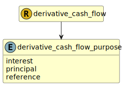

&lt;&nbsp; [Namespace](index.md)
#  fire.model.derivative_cash_flow_purpose
>  
>The purpose for which the derivative cash flow is calculated
> 

## Local Fields

| Name        | Description |
| ----------- | ----------- |
| interest |   |
| principal |   |
| reference |   |

 

### Referenced from fields in:
-  [fire.model.derivative_cash_flow](UDT-fire.model.derivative_cash_flow.md)
