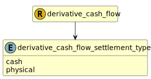

&lt;&nbsp; [Namespace](index.md)
#  fire.model.derivative_cash_flow_settlement_type
>  
>The type of settlement for the contract.
> 

## Local Fields

| Name        | Description |
| ----------- | ----------- |
| cash |   |
| physical |   |

 

### Referenced from fields in:
-  [fire.model.derivative_cash_flow](UDT-fire.model.derivative_cash_flow.md)
