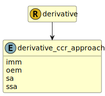

&lt;&nbsp; [Namespace](index.md)
#  fire.model.derivative_ccr_approach
>  
>Specifies the approved counterparty credit risk methodology for calculating exposures.
> 

## Local Fields

| Name        | Description |
| ----------- | ----------- |
| imm |   |
| oem |   |
| sa |   |
| ssa |   |

 

### Referenced from fields in:
-  [fire.model.derivative](UDT-fire.model.derivative.md)
