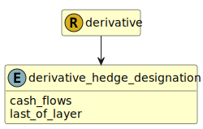

&lt;&nbsp; [Namespace](index.md)
#  fire.model.derivative_hedge_designation
>  
>ASU 2017-12 hedge designations allowed in conjunction with partial-term hedging election in ASC 815-20-25-12b(2)(ii). These designations are described in ASC 815-20-25-12A and 815-25-35-13B.
>
>()
>()
> 

## Local Fields

| Name        | Description |
| ----------- | ----------- |
| cash_flows |   |
| last_of_layer |   |

 

### Referenced from fields in:
-  [fire.model.derivative](UDT-fire.model.derivative.md)
