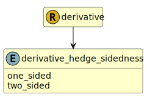

&lt;&nbsp; [Namespace](index.md)
#  fire.model.derivative_hedge_sidedness
>  
>Whether the hedging instrument provides a one-sided effective offset of the hedged risk, as permitted under ASC 815-20-25-76.
>
>()
> 

## Local Fields

| Name        | Description |
| ----------- | ----------- |
| one_sided |   |
| two_sided |   |

 

### Referenced from fields in:
-  [fire.model.derivative](UDT-fire.model.derivative.md)
