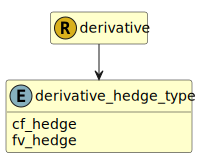

&lt;&nbsp; [Namespace](index.md)
#  fire.model.derivative_hedge_type
>  
>The type of hedge (fair value or cash flow hedge) associated with the holding. Whether it is hedging individually or is hedging as part of a portfolio of assets with similar risk that are hedged as a group in line with ASC 815-20-25-12 (b), ASC 815-20-2512A, or ASC 815-10-25-15.
>
>()
>()
>()
> 

## Local Fields

| Name        | Description |
| ----------- | ----------- |
| cf_hedge |   |
| fv_hedge |   |

 

### Referenced from fields in:
-  [fire.model.derivative](UDT-fire.model.derivative.md)
