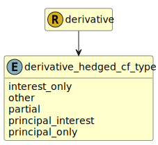

&lt;&nbsp; [Namespace](index.md)
#  fire.model.derivative_hedged_cf_type
>  
>The type of cash flow associated with the hedge if it is a cash flow hedge. Refer to https://www.federalreserve.gov/apps/reportingforms/Report/Index/FR_Y-14Q for more information.
> 

## Local Fields

| Name        | Description |
| ----------- | ----------- |
| interest_only |   |
| other |   |
| partial |   |
| principal_interest |   |
| principal_only |   |

 

### Referenced from fields in:
-  [fire.model.derivative](UDT-fire.model.derivative.md)
