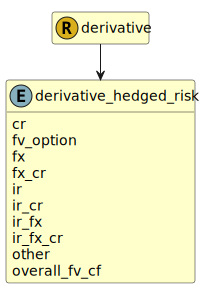

&lt;&nbsp; [Namespace](index.md)
#  fire.model.derivative_hedged_risk
>  
>The risk being hedged, among the potential hedged risks described under ASC 815-20-25-12 and ASC 815-20-25-15.
>
>()
>()
> 

## Local Fields

| Name        | Description |
| ----------- | ----------- |
| cr |   |
| fv_option |   |
| fx |   |
| fx_cr |   |
| ir |   |
| ir_cr |   |
| ir_fx |   |
| ir_fx_cr |   |
| other |   |
| overall_fv_cf |   |

 

### Referenced from fields in:
-  [fire.model.derivative](UDT-fire.model.derivative.md)
