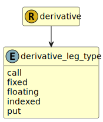

&lt;&nbsp; [Namespace](index.md)
#  fire.model.derivative_leg_type
>  
>Describe the payoff type of the derivative leg.
> 

## Local Fields

| Name        | Description |
| ----------- | ----------- |
| call |   |
| fixed |   |
| floating |   |
| indexed |   |
| put |   |

 

### Referenced from fields in:
-  [fire.model.derivative](UDT-fire.model.derivative.md)
