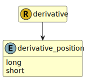

&lt;&nbsp; [Namespace](index.md)
#  fire.model.derivative_position
>  
>Specifies the market position, i.e. long or short, of the derivative leg
> 

## Local Fields

| Name        | Description |
| ----------- | ----------- |
| long |   |
| short |   |

 

### Referenced from fields in:
-  [fire.model.derivative](UDT-fire.model.derivative.md)
