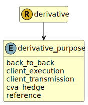

&lt;&nbsp; [Namespace](index.md)
#  fire.model.derivative_purpose
>  
>The purpose for which the derivative is being held.
> 

## Local Fields

| Name        | Description |
| ----------- | ----------- |
| back_to_back |   |
| client_execution |   |
| client_transmission |   |
| cva_hedge |   |
| reference |   |

 

### Referenced from fields in:
-  [fire.model.derivative](UDT-fire.model.derivative.md)
